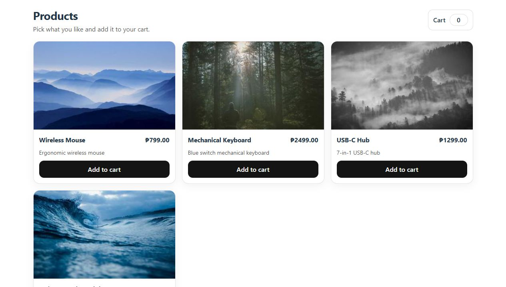
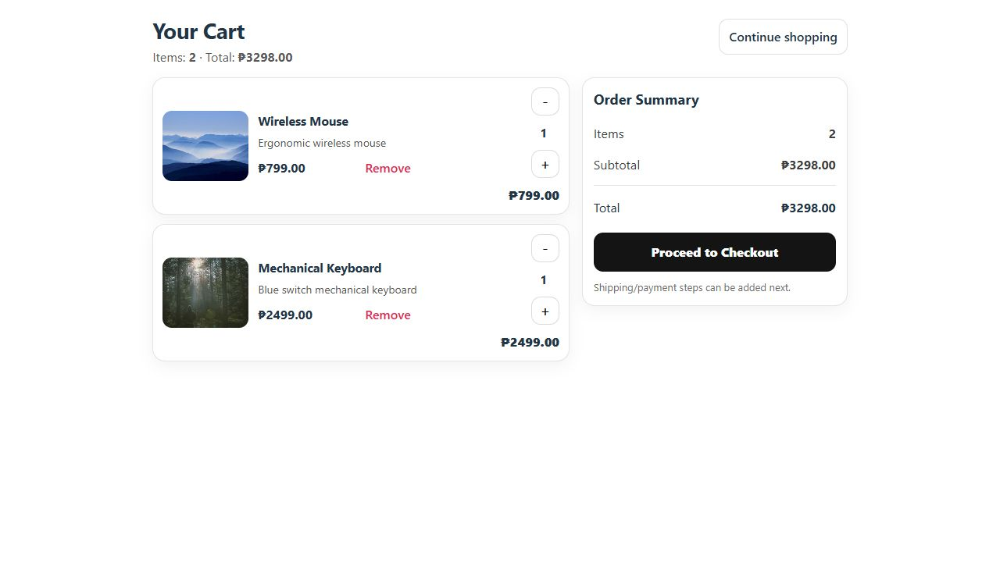
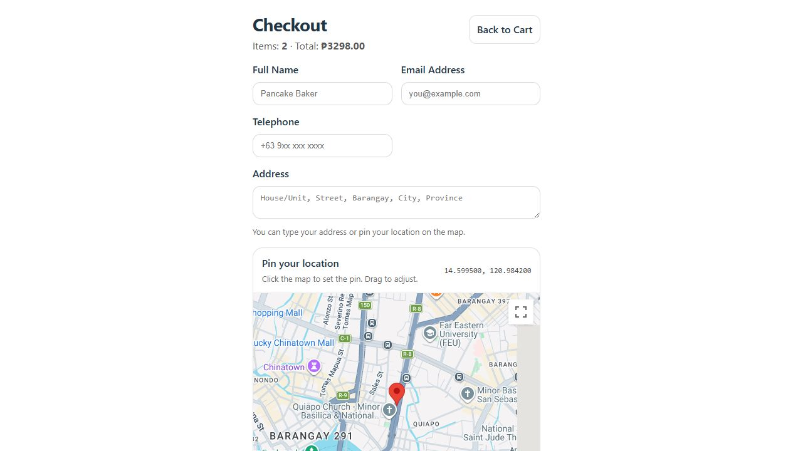

# C# React Shopping Cart

[](https://github.com/pancakebaker/csharp-react-shoppingcart-gmaps-demo/actions/workflows/ci.yml)

A full-stack shopping cart demo application built with ASP.NET Core on the backend and React on the frontend.

This project demonstrates a product listing, cart state management, checkout form validation, Google Maps delivery pin selection, order submission, and automated tests.

> This repository is a demo project intended for portfolio and learning purposes.

---

## Demo Screenshots

### Products



### Cart



### Checkout With Google Maps



---

## Features

- Product listing
- Add, remove, increment, and decrement cart items
- Cart state management with React Context
- Checkout form with customer details
- Google Maps delivery pin picker
- In-memory order storage for demo-friendly backend behavior
- Backend unit tests with xUnit
- Frontend tests with Vitest and React Testing Library
- GitHub Actions CI for backend and frontend checks

---

## Tech Stack

### Backend

- ASP.NET Core / C#
- xUnit
- In-memory data store
- Swagger / OpenAPI

### Frontend

- React
- Vite
- React Router
- Context API
- Vitest
- React Testing Library
- ESLint flat config

---

## Getting Started

### Prerequisites

- .NET SDK 8+
- Node.js 20+
- npm

---

## Backend Setup

From the repository root:

```powershell
cd ShoppingCartApp
dotnet restore
dotnet build
dotnet run --project .\ShoppingCartApp\ShoppingCartApp.csproj --launch-profile https
```

Backend runs on:

```text
https://localhost:7296
```

Swagger is available at:

```text
https://localhost:7296/swagger
```

If the HTTPS URL does not load, trust the local development certificate once:

```powershell
dotnet dev-certs https --trust
```

The backend also exposes the HTTP profile at:

```text
http://localhost:5109
```

---

## Frontend Setup

From the repository root:

```powershell
cd ShoppingCartUI
npm install
```

Create a `.env` file inside the `ShoppingCartUI` directory:

```env
VITE_API_BASE=/
VITE_GOOGLE_MAPS_API_KEY=<your key>
```

`VITE_API_BASE=/` uses the Vite proxy in `ShoppingCartUI/vite.config.js`, which avoids browser HTTPS certificate issues during local development.

Then start the frontend:

```powershell
npm run dev
```

Frontend runs on:

```text
http://localhost:5173
```

---

## Running Tests

### Backend

```powershell
cd ShoppingCartApp
dotnet test
```

### Frontend

```powershell
cd ShoppingCartUI
npm run test:run
```

---

## Continuous Integration

GitHub Actions runs checks on every push and pull request to `main`:

- Backend: `dotnet restore` and `dotnet test`
- Frontend: `npm ci`, `npm run build`, and `npm run test:run`

Workflow file:

```text
.github/workflows/ci.yml
```

---

## Design Notes

- The backend uses in-memory storage to keep the demo simple and fast to run.
- Product prices are recalculated server-side when an order is submitted.
- The frontend stores cart contents in `localStorage`.
- No real payment gateway, credentials, or production user data are included.

---

## Possible Improvements

- Database persistence with EF Core and SQLite or PostgreSQL
- Authentication and authorization
- Payment gateway integration
- Docker support
- Deployment workflow
- Product search and filtering
- Better product imagery

---

## Author

PancakeBaker  
Senior Full-Stack Web Developer

---

## License

MIT License
